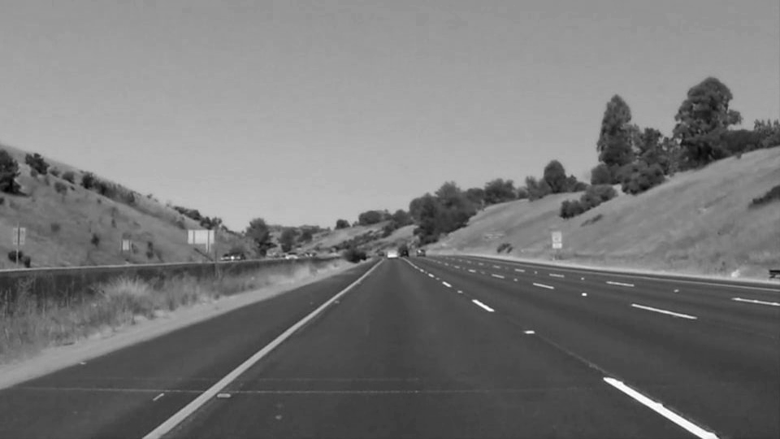
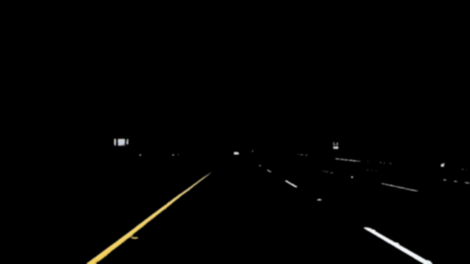
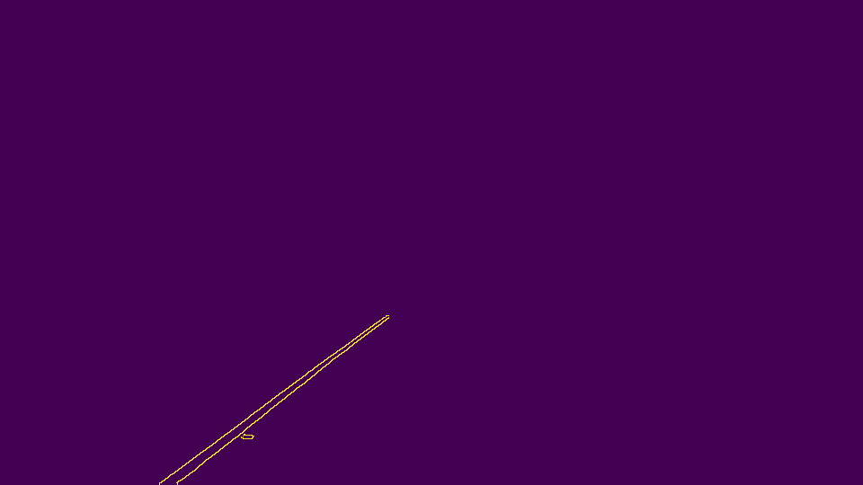
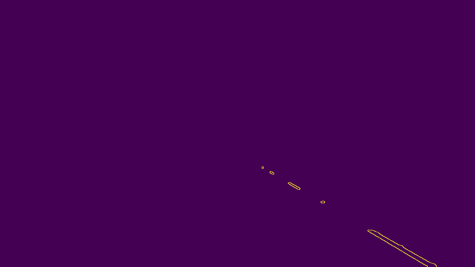
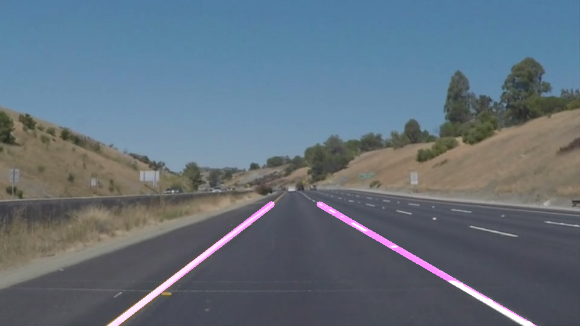

#**Finding Lane Lines on the Road** 

Self-driving car needs percieve the world as humans do when they drive. Humans use their eyes to figure out how fast they go, where the lane lines are and where are the turns. Car does not have eyes but self-driving cars can use cameras and other sensors to keep the similar function. So what does cameras are seeing as we drive down the road is not the same as what we perceive. We have to teach the car how to percieve lane lines and turns. Naturally, one of the first things we would like to do in developing a self-driving car is to automatically detect lane lines using an algorithm.

Here we are using [OpenCV](http://docs.opencv.org/3.0-beta/doc/py_tutorials/py_tutorials.html)_A comprehensive Computer Vision library to understand captured images from the car and translate them to mathematical entities so we can show the car where the lane line is to follow. The algorithm I have chosen has multiple steps for maniplating each frame image in order to reduce or better said eliminate noises as much as possible. Since the car does not need to see the trees or clouds in the sky for detecting lane lines. In addition to reducing noises we try to highlight lane lines as much as possible by highlighting them using some image processing algorithms. 
But the question is what features of lane lines do we need to highlight? Well, we can leverage following features to best identify various lane line in the image:
* color
* shape
* orientation
* position of the image

The line detection algorithm has multiple steps and the most important thing is to tweek all the required parameters well enough to not to loose any valuable pixle in the image. 

## Basics

The first step in detecting lane lines is understanding how images are represented. A 2D image can be represented as a rectangular grid, composed of many square cells, called pixels. Just like the black and white squares on the chessboard, pixels are nicely aligned in straight lines, both horizontally and vertically. We will refer to the horizontal ones as rows and to the vertical ones as columns. It is easy to see that a chessboard has 8 rows and 8 columns. But an image can have many rows and columns and we can find that out by using OpenCV **image.shape** . This returns a tuple of number of rows, columns and channels (if image is color).

``` python
  >> image = cv2.imread('kitten.jpg')
  >> print(image.shape)
    (342, 548, 3)
```
If you want to know how many pixles this image has you can use **img.size** which returns the number of pixles in the image.
Each pixle in the image is represented in a 3D space as (R, G, B) values. Each of these values is in range [0-255]. So with this explanation we saw that images are basically **tensors** with different number of rows, columns and elements per each color channel.

Understanding of mathematical features of an image and its representation is a great help solving computer vision challanges and understanding image processing algorithms.


### Lane line detection algorithm


Now let's desribe the used algorithm to detect lane lines step by step.
Assume we have the above image captured by our car in a highway. 

  1. **Grayscale**
  As you see lanes are either white or yellow on the streets. So we need to identify both.First we need to convert our image shape from a tensor (A, B, C) to a Matrix (A, B) to be able to only deal with raw pixles. In this case yellow and white considered both the same. In order to achieve that we can use *OpenCV GrayScale* method.
  
  ```python
    def grayscale(img):
      return cv2.cvtColor(img, cv2.COLOR_BGR2GRAY)
  ```
  
  
  
  
  2. **Pixle Filtering**
  As an enhancement here we also can identify only pixles with white or yellow color which helps out to filter out more pixles. 
  
  ```python
    def select_white_yellow(image):
      converted = cv2.cvtColor(image, cv2.COLOR_RGB2HLS)
      # white color mask
      lower = np.uint8([  0, 200,   0])
      upper = np.uint8([255, 255, 255])
      white_mask = cv2.inRange(converted, lower, upper)
      # yellow color mask
      lower = np.uint8([ 10,   0, 100])
      upper = np.uint8([ 40, 255, 255])
      yellow_mask = cv2.inRange(converted, lower, upper)
      # combine the mask
      mask = cv2.bitwise_or(white_mask, yellow_mask)
      return cv2.bitwise_and(image, image, mask = mask)
  ```
  
  
    
  3.  **Gaussian Blur**
   Now we need to apply a smoothing function to reduce image noise and detail. This also helps to smooth out edges in the image before applying Canny edge detection algorithm which is the next step.
    
    ```python
      def gaussian_noise(img, kernel_size):
        return cv2.GaussianBlur(img, (kernel_size, kernel_size), 0)
    ```
    
    
    
  4. **Canny Edge Detection**
    This approach using differential values of the image to detect boaundries which are between three regions. Those regions are identifies by high and low thresholds which we feed to the function.
    ```python
    def canny(img, low_threshold, high_threshold):
      return cv2.Canny(img, low_threshold, high_threshold)
    ```
     
     
     Here to maximize the edges I did dialated the image too.
     
     
     
  5. **Masked Image**
  Now we have to narrow down our analysis to a section of image that lane lines are. In order to to do apply a trapezoidal mask over its edges. Here as an enhancement I applied two different masks one for right and one for left lane to have better detection specially on turns and curvy lanes.
  
  ```python
    def region_of_interest(img, vertices):
      #defining a blank mask to start with
      mask = np.zeros_like(img)   

      #defining a 3 channel or 1 channel color to fill the mask with depending on the input image
      if len(img.shape) > 2:
          channel_count = img.shape[2]  # i.e. 3 or 4 depending on your image
          ignore_mask_color = (255,) * channel_count
      else:
          ignore_mask_color = 255

      #filling pixels inside the polygon defined by "vertices" with the fill color    
      cv2.fillPoly(mask, vertices, ignore_mask_color)

      #returning the image only where mask pixels are nonzero
      masked_image = cv2.bitwise_and(img, mask)
      return masked_image
  ```
  
  
  
  
  6. **Hough Transform**
  So far we did a great job identifying lane lines in the picture, now we need to draw them to show the machine where the lanes are. In order to draw lines in images or video frames we use a technique called *Hough Transform* which is basically determines for each given pixel in the picture if there is a straight line passing through the pixel. The algorithm uses 5 parameters which are rho, theta, min_votes, min_line_length and max_line_gap. You can read more about Hough transform algorithm [here](http://homepages.inf.ed.ac.uk/rbf/HIPR2/hough.htm).
  
  ```python
    lines = cv2.HoughLinesP(img, rho, theta, threshold, np.array([]), minLineLength=min_line_len,
                            maxLineGap=max_line_gap)
    #line_img = np.zeros(img.shape, dtype=np.uint8)
    #draw_lines(line_img, lines)
    #return line_img
    return lines
  ```
  We draw the lines separately for left and right side.
  I did tweak this function a little bit for applying some more filtering on lines and adjusting line's slopes. I am going go cover those in a the sext section.
  
  6~. Adjustements to improve lane detection
  
    a. Filtering slopes
    Here I have applied some enhancements to draw lines more efficiently. When I first applied hough tranform I  got so many other lines wich their slopes were different than the lane line and I have to filter those out. 
    Following function looks through all the hough transformed lines and filter those out based on the defined min and max slopes. This will help specifically with curved lines which slope changes are significant.
    
    ```python
      def slope_filter(lines_array, positive, min_slope, max_slope):
        slopes = np.apply_along_axis(lambda row: (row[3] - row[1]) / (row[2] - row[0]), 2, lines_array)
        if positive:
            slopes[slopes > max_slope] = 0
            slopes[slopes < min_slope] = 0
            lines_array = np.array(lines_array[np.where(slopes > 0)])
        else:
            slopes[slopes < -max_slope] = 0
            slopes[slopes > -min_slope] = 0
            lines_array = np.array(lines_array[np.where(slopes < 0)])

        return lines_array

    ```
    b. Linear Regression
    Linear Regression comes handy when identifying curved lines. It uses standard error of the estimate is a measure of the accuracy of predictions. Recall that the regression line is the line that minimizes the sum of squared deviations of prediction (also called the sum of squares error). The standard error of the estimate is closely related to this quantity and is defined below:
    
    
    
    where σest is the standard error of the estimate, Y is an actual score, Y' is a predicted score, and N is the number of pairs of scores. The numerator is the sum of squared differences between the actual scores and the predicted scores.
    
    In summary if we have a line, y = mx + c, through some noisy data-points, By examining the coefficients, we see that the line should have a gradient of roughly g1 and cut the y-axis at, more or less, y0. We can rewrite the line equation as y = Ap, where A = [[x 1]] and p = [[m], [c]]. Now use lstsq to solve for p. 
    In a simpler language linear regression can draw a best line regarding a given number of points so that the Root Mean Squared Error is minimized.
    
    

    
    As you must realized linear regression can do the same identifying the best line amoung all the hough lines and efficenizing the slope by redusing RMSE.
    
    ```python
    def lines_linreg(lines_array):
      ### Select the 0th and 2nd index which will provide the xval and reshape to extract x values
      x = np.reshape(lines_array[:, [0, 2]], (1, len(lines_array) * 2))[0]
      ### Select the 1st and 3rd index which will provide the yval and reshape to extract 7 values
      y = np.reshape(lines_array[:, [1, 3]], (1, len(lines_array) * 2))[0]
      A = np.vstack([x, np.ones(len(x))]).T
      m, c = np.linalg.lstsq(A, y)[0]
      x = np.array(x)
      y = np.array(x * m + c)
      return x, y, m, c
   ```   
    
  
  7. **Weighted Image**
  In this step we only need to overlay hough image and original image to display lines we call the resulted image weighted image.
  
  ```python
    def weighted_img(img, initial_img, α=0.8, β=1., λ=0.):
      return cv2.addWeighted(initial_img, α, img, β, λ)
      
    color_with_lines = np.zeros(image.shape, dtype=np.uint8)
    color_with_lines = draw_lines(color_with_lines, lines_left, lines_right, [255, 0, 0], 10)
    result = weighted_img(color_with_lines, image)   
  ```
  
   

### Reflection

###1. Describe your pipeline. As part of the description, explain how you modified the draw_lines() function.

My pipeline consisted of 5 steps. First, I converted the images to grayscale, then I .... 

In order to draw a single line on the left and right lanes, I modified the draw_lines() function by ...

If you'd like to include images to show how the pipeline works, here is how to include an image: 

![alt text][image1]


###2. Identify potential shortcomings with your current pipeline


One potential shortcoming would be what would happen when ... 

Another shortcoming could be ...


###3. Suggest possible improvements to your pipeline

A possible improvement would be to ...

Another potential improvement could be to ...
